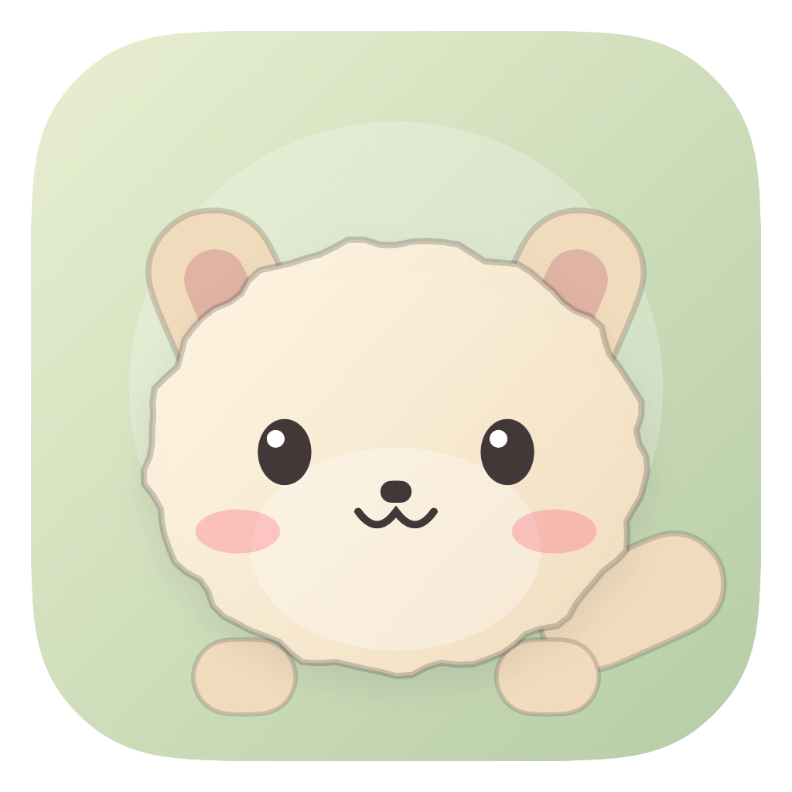
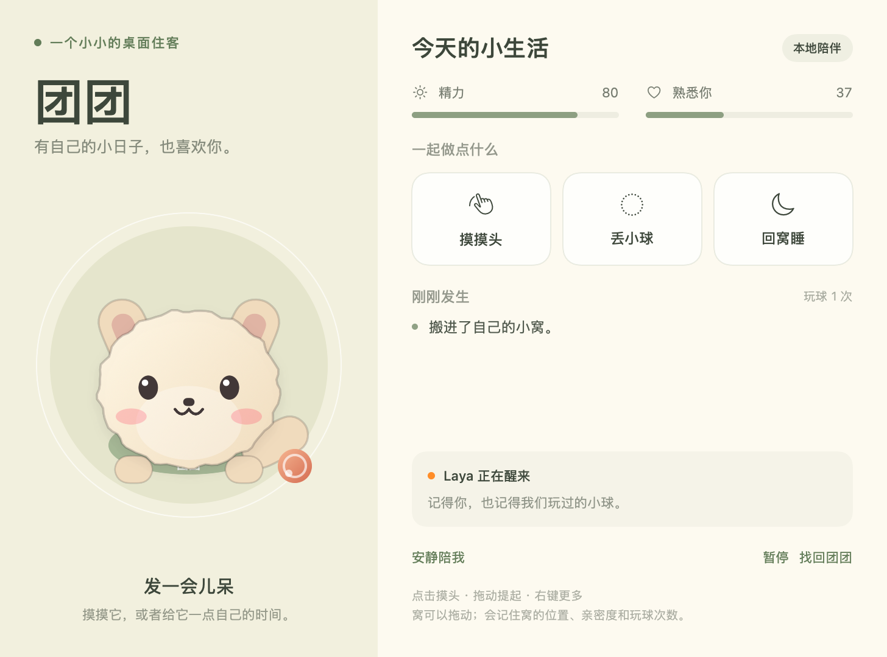

<div align="center">
  
  <h1>团团 · Tuantuan</h1>
  <p>一个有自己的小日子，也喜欢你的 Mac 桌面住客。</p>
  <p>A native macOS desktop companion with local Laya decisions.</p>
</div>

> **引用与致谢：** 本项目使用 [NandhaKishorM/laya](https://github.com/NandhaKishorM/laya) 的决策模型，通过 [mizorewww/laya-mlx](https://github.com/mizorewww/laya-mlx) 在 Apple Silicon 上运行。感谢 Laya 作者、Convai Innovations 和相关贡献者。团团是独立的第三方应用，不是 Laya 官方项目。



## 当前版本

**v0.1.0 · 本地试玩原型。** 独立原生 Mac App，使用 AppKit / SwiftUI，角色与图标来自同一套矢量绘制。无需 Codex。

- 点击摸头、拖动提起，鼠标靠近时会观察或受到惊吓。
- 丢球、追球、推球，玩累后停下来。
- 回窝后打盹；可以拖动小窝。
- 记住亲密度、玩球次数和窝的位置。
- 安静陪伴、暂停、找回角色，以及独立控制窗口。
- Laya 选择高层行为；运动、动画、边界与互动保护由应用负责。

Laya 通常每 7 秒考虑一次下一步，主动互动和睡眠期间会暂缓。模型不可用时会明确显示「基础互动可用」。当前记忆是本地保存的状态，不代表在线学习或模型训练。

## 两种构建方式

仓库包含源码和角色素材，**不包含模型权重、Python 环境或预编译 App**。目前没有提供经过 Apple 公证的安装包。

### 只体验角色与互动

需要 Apple Silicon Mac、macOS 14+、Xcode / Swift 5.10+，以及用于打包的 Python 3。

```sh
git clone https://github.com/JunbiaoXue/Tuantuan.git
cd Tuantuan
swift test
python3 package.py
open dist/团团.app
```

此模式有摸头、拖拽、玩球、回窝和记忆；没有 Laya 自主决策。运行状态会说明模型不可用。

### 包含本地 Laya 的完整 App

当前完整打包方案面向 **Apple Silicon、macOS 26+、Homebrew framework Python 3.14**。本机在 macOS 27 验证过，其他环境尚未全面验证。需先安装 Python 3.14 和 Xcode 命令行工具。

```sh
python3.14 -m venv .venv
.venv/bin/python -m pip install -r runtime/requirements.txt

# 仅此步骤下载模型；固定到已验证的权重快照。
.venv/bin/python runtime/download_model.py

.venv/bin/python package.py --with-laya \
  --model-dir models/laya-multilingual-mlx \
  --output dist/团团-Laya.app
open dist/团团-Laya.app
```

完整 App 约 1 GB。打包后 Python、运行依赖与模型均在 App 内；推理使用离线模式。打包脚本不下载依赖，也不覆盖已有 App；重复构建请指定新的 `--output`。

如果 Python 不是 framework 构建，需要通过 `--python-framework` 指向包含 `Python`、`Resources/Python.app` 与 `lib/` 的 framework 版本目录；这不是通用跨平台打包器。

## 使用

| 操作 | 效果 |
| --- | --- |
| 点角色 | 摸头，增加熟悉度 |
| 拖角色 | 提起，放下后整理毛发 |
| 点球 / 丢小球 | 追球与推球 |
| 点窝 / 回窝睡 | 走回窝再睡觉 |
| 拖窝 | 修改并记住窝的位置 |
| 安静陪我 | 减少自主移动 |
| 暂停 | 停止运动和状态变化 |
| 找回团团 | 把角色和物品移回可见区域 |

关闭控制窗口后桌宠继续存在。点击 Dock 图标、菜单栏爪印或按 ⌘1 重新打开；⌘Q 完全退出。

## 结构与隐私

```text
SwiftUI 角色和小屋界面
        ↓
AppKit 桌面窗口、物理运动和互动状态
        ↓  本地管道 / JSON Lines
Python → laya-mlx → 本地 Laya 权重
```

模型收到的内容包括精力、亲密度、鼠标距离、安静模式与上一个动作。应用不读取截图、文档、剪贴板或键盘内容，也不把桌面活动上传到服务端。

记忆保存于 `~/Library/Application Support/Tuantuan/memory.json`；窝的位置保存在应用偏好设置中。事件列表只保留当前会话。

## 验证与限制

- 8 项 Swift 自动检查覆盖用户互动优先级、记忆恢复、暂停、安静模式、低精力回窝和坐标边界等。
- 本机完成摸头、玩球、回窝睡眠、窗口重新打开及真实 Laya 推理验证。
- 尚未系统验证长期耗电、多显示器组合、睡眠唤醒和其他 Mac 环境。
- 没有宠物场景的模型训练或准确率评测；模型输出不等于动物认知，行为仍受应用约束。
- 当前使用本地临时签名；无 Apple 公证、自动更新、登录启动功能。

升级方向见 [ROADMAP.md](ROADMAP.md)。

## 模型来源与引用

| 组件 | 来源 | 用途 |
| --- | --- | --- |
| **Laya 原项目** | **[NandhaKishorM/laya](https://github.com/NandhaKishorM/laya)** | 原始决策模型与方法 |
| Laya MLX | [mizorewww/laya-mlx](https://github.com/mizorewww/laya-mlx) | Apple Silicon 本地推理，使用 `laya-mlx==0.2.0` |
| 多语言权重 | [aac6fef/laya-multilingual-mlx](https://huggingface.co/aac6fef/laya-multilingual-mlx) | 本地模型，单独下载 |

固定权重快照：`f2b4faf51023039425946074e2cf1361d2db11d5`。应用源码不包含上游模型实现或权重；完整打包时才会将依赖和权重复制进 App。

## 许可证

团团自身的应用代码、构建脚本和文档以 **[MIT License](LICENSE)** 开源，允许使用、修改、分发和商业使用，需保留许可证及版权声明。

Laya、laya-mlx、模型权重及其他第三方组件仍遵循各自的许可证，不因本项目采用 MIT 而变更。相关版权、许可及署名说明见 [THIRD_PARTY_NOTICES.md](THIRD_PARTY_NOTICES.md) 和 [licenses/](licenses/)。
